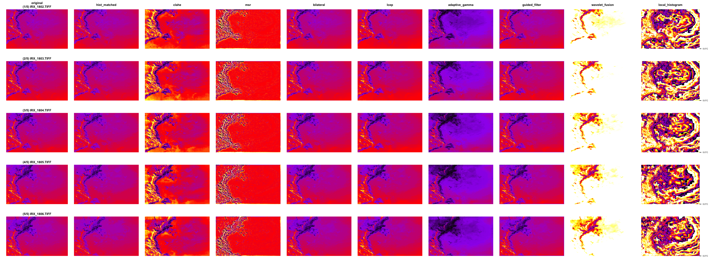

# Thermal Image Calibration Tools

A comprehensive R toolkit for calibrating and processing thermal camera images using various enhancement and calibration techniques.


## Features

* Multiple calibration and enhancement methods:
  * Sequential Histogram Matching
  * CLAHE (Contrast Limited Adaptive Histogram Equalization)
  * MSR (Multi-Scale Retinex)
  * Bilateral Filtering
  * LCEP (Local Contrast Enhancement with Edge Preservation)
  * Adaptive Gamma Correction
  * Guided Filtering
  * Wavelet-based Fusion
  * Local Histogram Equalization

## Prerequisites

```R
# Install required packages
install.packages(c("tiff", "EBImage", "grid", "gridExtra", "parallel", "doParallel"))

# For EBImage (Bioconductor package)
if (!require("BiocManager", quietly = TRUE))
    install.packages("BiocManager")
BiocManager::install("EBImage")
```

## Usage

### Basic Usage

```R
# Process all images using all methods
process_thermal_images("./images", "./processed_images")

# Use specific methods
process_thermal_images("./images", "./processed_images", 
                      methods = c("hist_matched", "clahe", "adaptive_gamma"))

# Use single method with parallel processing disabled
process_thermal_images("./images", "./processed_images", 
                      methods = "bilateral",
                      parallel = FALSE)
```

### Available Methods

* `original`: Original thermal image (always included)
* `hist_matched`: Sequential histogram matching
* `clahe`: Contrast Limited Adaptive Histogram Equalization
* `msr`: Multi-Scale Retinex
* `bilateral`: Bilateral Filter
* `lcep`: Local Contrast Enhancement with Edge Preservation
* `adaptive_gamma`: Adaptive Gamma Correction
* `guided_filter`: Edge-Preserving Guided Filter
* `wavelet_fusion`: Multi-scale Wavelet Fusion
* `local_histogram`: Local Histogram Equalization

## Output Structure

```
processed_images/
├── comparisons/
│   ├── methods_comparison.png
│   └── processing_summary.txt
└── processed/
    ├── hist_matched/
    ├── clahe/
    ├── msr/
    ├── bilateral/
    ├── lcep/
    ├── adaptive_gamma/
    ├── guided_filter/
    ├── wavelet_fusion/
    └── local_histogram/
```

* `comparisons/`: Contains side-by-side visual comparisons and processing summary
* `processed/`: Contains processed images in method-specific subdirectories

## Method Details

### Sequential Histogram Matching
Matches histograms sequentially through the image sequence, using the first frame as reference. Maintains consistency across the thermal sequence.

### CLAHE
Enhances local contrast while limiting amplification to reduce noise. Particularly effective for thermal images with varying temperature distributions.

### Multi-Scale Retinex (MSR)
Enhances image details across multiple scales while maintaining temperature relationships. Adaptive scaling for optimal enhancement.

### Bilateral Filter
Edge-preserving smoothing that reduces noise while maintaining sharp temperature boundaries. Automatically adapts parameters to image characteristics.

### LCEP
Enhances local contrast while preserving edge information, useful for highlighting thermal features without introducing artifacts.

### Adaptive Gamma Correction
Applies spatially varying gamma correction based on local image statistics. Enhances details in both dark and bright regions.

### Guided Filter
Edge-preserving smoothing using a guidance image. Provides better edge preservation than bilateral filtering with faster processing.

### Wavelet-based Fusion
Multi-scale decomposition and enhancement using Gaussian pyramids. Enhances features at different scales while maintaining global structure.

### Local Histogram Equalization
Applies histogram equalization in local windows with contrast limiting. Enhances local details while preventing noise amplification.

## Parameters

* `input_dir`: Directory containing TIFF format thermal images
* `output_dir`: Directory for processed outputs
* `methods`: Vector of method names or "all" for all methods
* `parallel`: Boolean to enable/disable parallel processing (default: TRUE)

## Performance Optimizations

* Parallel processing support for faster execution
* Memory-efficient processing of large images
* Progress tracking for long operations
* Automatic parameter selection based on image characteristics
* Limited visualization output (max 100 images) to prevent memory issues

## Error Handling

The script includes comprehensive error handling for:
* Missing input directory or files
* Invalid method selection
* Memory limitations
* Processing errors for individual files
* Invalid image dimensions or content

## Example

```R
# Load required libraries
library(tiff)
library(EBImage)
library(grid)
library(gridExtra)
library(parallel)
library(doParallel)

# Process thermal images with multiple methods
process_thermal_images(
  input_dir = "./thermal_sequence",
  output_dir = "./calibrated_output",
  methods = c("hist_matched", "adaptive_gamma", "guided_filter")
)
```

## Notes

* All methods preserve original temperature relationships
* Images are processed in alphanumeric order
* Original temperature ranges are maintained in saved TIFF files
* Visualization includes thermal colormap (black-purple-red-yellow-white)
* Processing summary is saved with details of all processed images
* Visualization is limited to first 100 images for memory efficiency
